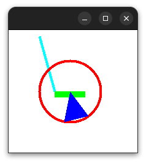

# XWrap: A Simple C Wrapper Renderer for X11

XWrap is a lightweight and user-friendly C/C++ library designed for rendering simple graphics, including images, on X11 window systems. It offers a straightforward and intuitive API for creating windows, drawing lines and shapes, handling user input events, and rendering images.

## Key Features:

- Single Header: The library is conveniently packaged in a single header file, making it easy to include and use in your projects.
- Automatic Linking: XWrap can automatically link with X11, eliminating the need for manual linking during the compilation process. This feature allows for seamless integration with X11 without requiring additional configuration.
- Simplicity: XWrap focuses on providing a simple interface without an overwhelming number of options. For more advanced functionality, you can utilize the features offered by X11 directly.



## Dependency

To use XWrap, you can take advantage of its auto-linking feature. However, if you prefer to link X11 manually or if you need more advanced X11 functionality, you will need to have the libx11-dev library installed for standard linking. You can install it using the following command:

```sh
$ sudo apt install libx11-dev
```

Please note that if you choose to use XWrap's auto-linking feature, **the installation of libx11-dev is not required**, you only need to have X11 in your system.
